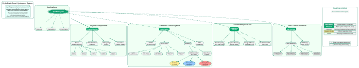

# Smart Hydroponic Tower System

A complete smart system for monitoring and controlling a hydroponic tower using an ESP32, featuring a TFT display and a responsive web dashboard over WiFi.

## Features

- Real-time sensor monitoring:
  - TDS (Total Dissolved Solids)
  - pH level
  - Water temperature
  - Air humidity and temperature (DHT22)
  - Water level using JSN sensor
- Web dashboard with:
  - Live readings
  - System status indicators
  - Pump and LED strip controls
  - Sensor data charts (Chart.js)
- Interface styled with Tailwind CSS
- Remote access via WiFi
- Built-in clock and system alerts
- Simple and responsive UI

## Components

- ESP32 (WROOM)
- ILI9341 TFT Display 3.2" (SPI)
- DHT22 sensor
- TDS sensor
- pH sensor
- DS18B20 waterproof temperature sensor
- JSN-SR04T water level sensor
- NeoPixel LED strip (90 LEDs)
- 12V Water pump + MOSFET
- 12V 3A power supply
- Buck and Boost converters
- Custom PCB or breadboard wiring

## Pin Mapping

| Component           | ESP32 Pin  |
|---------------------|------------|
| TFT CS              | GPIO 5     |
| TFT RST             | GPIO 4     |
| TFT DC              | GPIO 2     |
| TFT MOSI            | GPIO 23    |
| TFT CLK             | GPIO 18    |
| TFT Backlight (LED) | GPIO 33    |
| DHT22               | GPIO 21    |
| TDS Sensor          | GPIO 35    |
| pH Sensor           | GPIO 34    |
| JSN Trig            | GPIO 14    |
| JSN Echo            | GPIO 15    |
| DS18B20             | GPIO 32    |
| Water Pump          | GPIO 27    |
| NeoPixel Strip      | GPIO 19    |

## Required Libraries

- `Adafruit_GFX`
- `Adafruit_ILI9341`
- `DHT`
- `Adafruit_NeoPixel`
- `WiFi`
- `WebServer`
- `SPIFFS`
- `ArduinoJson`

## Web Dashboard

- Access the interface via the IP address printed in Serial Monitor
- View all sensor data in real-time
- Animated indicators for water level
- Toggle controls for the pump and LED strip
- Dynamic charts powered by Chart.js
- Tailwind CSS for clean styling
- Files served from ESP32 using SPIFFS

## How to Use

1. Upload the code using PlatformIO or Arduino IDE.
2. Connect the components according to the pin mapping table.
3. Update your WiFi credentials in the source code.
4. Flash the firmware to the ESP32.
5. Open a browser and navigate to the IP shown on the Serial Monitor.

## License

MIT License

## Developer

[Sultan Al-Jarboa](https://www.linkedin.com/in/sultanal-jrboa/)
